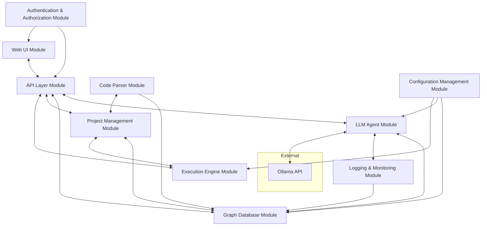

# Integrations and Dependencies Documentation

## Overview

This document outlines the integrations and dependencies between the various modules of the Graph-Based Codebase Management System (GBCMS). Understanding these relationships is crucial for effective development, maintenance, and scalability of the system.

## Module Dependencies

### 1. Graph Database Module

- **Dependencies:**
  - **External Libraries:**
    - **Neo4j**: Core graph database functionality.
    - **neo4j-driver**: Python library for interacting with Neo4j.
  - **Configuration Management Module**: Provides database connection settings.
  
- **Integrations:**
  - **LLM Agent Module**: Utilizes `QueryEngine` for fetching and modifying graph data.
  - **Code Parser Module**: Populates the graph database with parsed code structures.
  - **Logging and Monitoring Module**: Stores logs and thought entries as graph nodes.

### 2. LLM Agent Module

- **Dependencies:**
  - **Graph Database Module**: Accesses `NodeManager`, `EdgeManager`, and `QueryEngine` for graph operations.
  - **Logging and Monitoring Module**: Uses `ThoughtLogger` and `LogManager` for logging internal processes.
  - **API Layer Module**: Communicates via RESTful APIs for various operations.
  - **Ollama API**: External service for LLM functionalities.
  
- **Integrations:**
  - **Web User Interface (UI) Module**: Receives user inputs and sends responses through the chat interface.
  - **Error Handler Module**: Manages exceptions during LLM operations.

### 3. Web User Interface (UI) Module

- **Dependencies:**
  - **API Layer Module**: Interfaces with backend services via RESTful APIs and WebSockets.
  - **Graph Database Module**: Fetches and displays graph data through `QueryEngine`.
  - **Authentication and Authorization Module**: Secures user interactions and data access.
  
- **Integrations:**
  - **LLM Agent Module**: Facilitates user interactions with the LLM agent.
  - **Project Management Module**: Manages project-related actions initiated from the UI.
  - **Logging and Monitoring Module**: Logs UI interactions and events.

### 4. Code Parser Module

- **Dependencies:**
  - **Graph Database Module**: Inserts parsed code elements into the graph.
  - **Configuration Management Module**: Accesses parser configurations and language support settings.
  
- **Integrations:**
  - **Project Management Module**: Parses imported or newly created projects.
  - **Logging and Monitoring Module**: Logs parsing activities and errors.

### 5. Project Management Module

- **Dependencies:**
  - **Graph Database Module**: Manages project nodes and their relationships.
  - **Code Parser Module**: Parses project codebases.
  - **Authentication and Authorization Module**: Ensures secure project access and modifications.
  
- **Integrations:**
  - **Execution Engine Module**: Triggers project executions.
  - **LLM Agent Module**: Coordinates with the agent for project-related tasks.
  - **Logging and Monitoring Module**: Logs project lifecycle events.

### 6. Execution Engine Module

- **Dependencies:**
  - **Project Management Module**: Receives execution commands.
  - **Graph Database Module**: Retrieves project configurations and dependencies.
  - **Configuration Management Module**: Accesses environment and execution settings.
  
- **Integrations:**
  - **Logging and Monitoring Module**: Logs execution statuses and outputs.
  - **Authentication and Authorization Module**: Validates execution permissions.

### 7. API Layer Module

- **Dependencies:**
  - **All Core Modules**: Acts as an intermediary for communication between modules.
  - **Authentication and Authorization Module**: Secures API endpoints.
  
- **Integrations:**
  - **Web User Interface (UI) Module**: Provides frontend with necessary API endpoints.
  - **LLM Agent Module**: Facilitates backend operations through APIs.
  - **Logging and Monitoring Module**: Logs API requests and responses.

### 8. Authentication and Authorization Module

- **Dependencies:**
  - **API Layer Module**: Secures all API interactions.
  - **Web User Interface (UI) Module**: Manages user sessions and permissions.
  
- **Integrations:**
  - **All Modules**: Ensures that access controls are enforced across the system.
  - **Logging and Monitoring Module**: Logs authentication events and access attempts.

### 9. Logging and Monitoring Module

- **Dependencies:**
  - **Graph Database Module**: Stores logs as graph entries.
  - **API Layer Module**: Collects logs from API interactions.
  
- **Integrations:**
  - **All Modules**: Receives logging data from every module in the system.
  - **Monitoring Dashboard**: Visualizes real-time system metrics and logs.

### 10. Configuration Management Module

- **Dependencies:**
  - **All Modules**: Provides configuration settings and environment variables.
  - **External Services**: May integrate with external configuration providers or secrets managers.
  
- **Integrations:**
  - **Graph Database Module**: Retrieves database configurations.
  - **LLM Agent Module**: Accesses API keys and service credentials.
  - **Execution Engine Module**: Manages environment-specific settings.

## Visual Diagram

## Dependency Flow

1. **User Interaction:**
   - Users interact with the **Web UI Module**, which communicates with the **API Layer Module**.
   
2. **Data Management:**
   - The **API Layer** interfaces with the **Graph Database Module** to fetch or update codebase information.
   
3. **LLM Operations:**
   - The **LLM Agent Module** processes user instructions, interacts with the graph database, and uses external APIs like Ollama for advanced functionalities.
   
4. **Project Execution:**
   - The **Project Management Module** coordinates with the **Execution Engine Module** to run or manage projects based on user actions.
   
5. **Security and Logging:**
   - All interactions are secured via the **Authentication and Authorization Module**, and events are logged by the **Logging and Monitoring Module**.

## Conclusion

Understanding the integrations and dependencies between modules is essential for effective development and maintenance of the GBCMS. This documentation serves as a guide to navigate the complex interactions within the system, ensuring coherent and efficient module collaboration.

