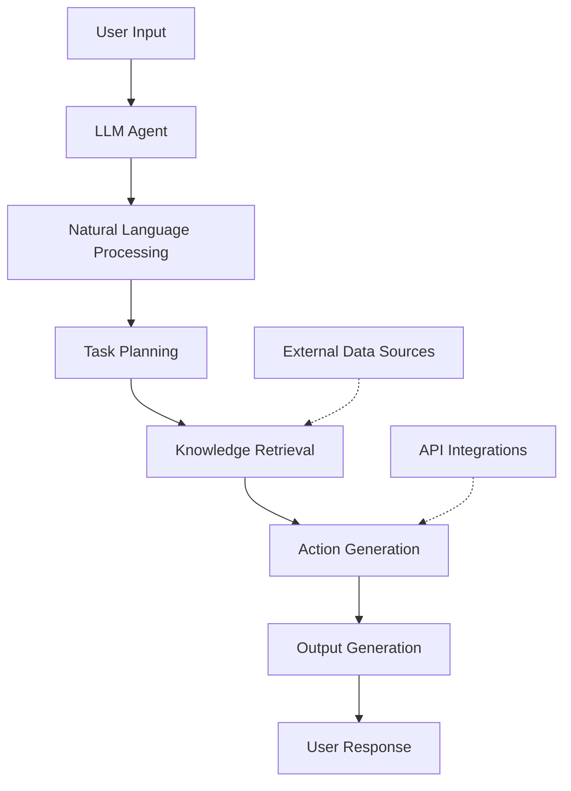

# LLM Agent Module Documentation

## Table of Contents
- [Overview](#overview)
- [Module Structure](#module-structure)
- [Components](#components)
  - [Natural Language Processor (NLP)](#natural-language-processor-nlp)
  - [Action Engine](#action-engine)
  - [Code Modification Engine](#code-modification-engine)
  - [Error Handler](#error-handler)
  - [Thought Logger](#thought-logger)
  - [Ollama API Interface](#ollama-api-interface)
- [Data Model](#data-model)
  - [Entities](#entities)
  - [Attributes](#attributes)
  - [Relationships](#relationships)
- [API Specifications](#api-specifications)
  - [Authentication & Authorization](#authentication--authorization)
  - [Endpoints](#endpoints)
    - [Send Prompt](#send-prompt)
    - [Get Response](#get-response)
- [Implementation Details](#implementation-details)
  - [Interaction Flow](#interaction-flow)
  - [Error Handling](#error-handling)
  - [Logging](#logging)
- [Security Considerations](#security-considerations)
- [Performance & Scalability](#performance--scalability)
- [Extensibility](#extensibility)
- [Example Use Cases](#example-use-cases)
- [Glossary](#glossary)
- [Visual Aids](#visual-aids)
- [Testing Strategies](#testing-strategies)
- [Deployment Instructions](#deployment-instructions)
- [Version Control and Update Logs](#version-control-and-update-logs)
- [Feedback Mechanism](#feedback-mechanism)
- [Licensing Information](#licensing-information)

## Overview
The LLM Agent Module is designed to facilitate intelligent interactions between users and the system through natural language processing. It leverages large language models (LLMs) to understand user inputs, execute code-related operations, and provide meaningful responses. The module integrates seamlessly with other components of the Graph-Based Codebase Management System (GBCMS) to enable dynamic code manipulation, error handling, and logging of internal processes.

### Key Responsibilities:
- **User Interaction**: Facilitate communication with users via chat interfaces.
- **Graph Interaction**: Retrieve and modify the codebase graph, including the module's own codebase when instructed.
- **Code Operations**: Perform code generation, refactoring, querying, and modifications based on user requests.
- **Error Handling and Logging**: Implement robust error handling and log internal thoughts and system events.
- **LLM Integration**: Interface with external LLM services (e.g., Ollama API) to leverage advanced language understanding and generation capabilities.

## Module Structure
The LLM Agent Module is composed of six primary components:
1. **Natural Language Processor (NLP)**
2. **Action Engine**
3. **Code Modification Engine**
4. **Error Handler**
5. **Thought Logger**
6. **Ollama API Interface**

Each component is encapsulated within its own class, promoting a clear separation of concerns and enhancing maintainability and scalability.

## Components

### Natural Language Processor (NLP)
**Description:**

Processes and interprets user inputs to understand intent and extract actionable information.

**Class: NLPProcessor**

**Methods:**
- `parse_input(user_message: str) -> dict`
  
  **Description:** Parses the user's message to identify intent and extract entities.
  
  **Parameters:**
  - `user_message`: The raw input message from the user.
  
  **Returns:** A dictionary containing parsed intent and entities.

- `generate_response(parsed_input: dict) -> str`
  
  **Description:** Generates a response based on the parsed input.
  
  **Parameters:**
  - `parsed_input`: The output from `parse_input`.
  
  **Returns:** A string response to be sent back to the user.

**Example Usage:**
python
```
nlp_processor = NLPProcessor()
parsed = nlp_processor.parse_input("Generate a new module for authentication.")
response = nlp_processor.generate_response(parsed)
```

---

### Action Engine
**Description:**

Determines and orchestrates actions based on parsed user inputs.

**Class: ActionEngine**

**Methods:**
- `decide_action(parsed_input: dict) -> str`
  
  **Description:** Decides which action to take based on the parsed input.
  
  **Parameters:**
  - `parsed_input`: The output from `NLPProcessor.parse_input`.
  
  **Returns:** The action identifier (e.g., "create_module").

- `execute_action(action: str, parameters: dict) -> dict`
  
  **Description:** Executes the determined action with the given parameters.
  
  **Parameters:**
  - `action`: The action to execute.
  - `parameters`: A dictionary of parameters required for the action.
  
  **Returns:** A dictionary containing the result of the action.

**Example Usage:**
python
```
action_engine = ActionEngine()
action = action_engine.decide_action(parsed_input)
result = action_engine.execute_action(action, parameters)
```


---

### Code Modification Engine
**Description:**

Handles modifications to the codebase based on user instructions and action outcomes.

**Class: CodeModifier**

**Methods:**
- `modify_code(node_id: str, new_content: str) -> dict`
  
  **Description:** Updates the content of a specified code node.
  
  **Parameters:**
  - `node_id`: The ID of the node to modify.
  - `new_content`: The updated code content.
  
  **Returns:** A dictionary representing the updated node.

- `generate_code(specification: dict) -> str`
  
  **Description:** Generates code based on a given specification.
  
  **Parameters:**
  - `specification`: A dictionary detailing the code requirements.
  
  **Returns:** A string containing the generated code.

**Example Usage:**
python
```
code_modifier = CodeModifier()
updated_node = code_modifier.modify_code(node_id="node123", new_content="def new_function(): pass")
generated_code = code_modifier.generate_code(specification={"module": "auth", "features": ["login", "signup"]})
```

---


### Error Handler
**Description:**

Manages exceptions and errors, ensuring the system responds gracefully to unexpected issues.

**Class: ErrorHandler**

**Methods:**
- `handle_error(error: Exception) -> dict`
  
  **Description:** Processes an exception and generates an appropriate response.
  
  **Parameters:**
  - `error`: The exception to handle.
  
  **Returns:** A dictionary containing error details and user-friendly messages.

- `generate_error_response(error: Exception) -> str`
  
  **Description:** Creates a user-friendly error message based on the exception.
  
  **Parameters:**
  - `error`: The exception to encapsulate in the response.
  
  **Returns:** A string containing the error message.

**Example Usage:**

python
```
error_handler = ErrorHandler()
try:
# Some operation that may fail
result = risky_operation()
except Exception as e:
error_details = error_handler.handle_error(e)
error_message = error_handler.generate_error_response(e)
```

---

### Thought Logger
**Description:**

Logs the internal reasoning and decisions made by the LLM agent for auditing and analysis purposes.

**Class: ThoughtLogger**

**Methods:**
- `log_thought(thought_content: str) -> None`
  
  **Description:** Logs a piece of internal reasoning or decision-making content.
  
  **Parameters:**
  - `thought_content`: The content to log.
  
  **Returns:** None

**Example Usage:**
python
```
thought_logger = ThoughtLogger()
thought_logger.log_thought("Decided to create a new authentication module based on user request.")
```


---


### Ollama API Interface
**Description:**

Handles communication with the Ollama API to leverage LLM functionalities for processing and generating natural language content.

**Class: OllamaClient**

**Methods:**
- `send_request(prompt: str) -> dict`
  
  **Description:** Sends a prompt to the Ollama API and retrieves the response.
  
  **Parameters:**
  - `prompt`: The input text to send to the LLM.
  
  **Returns:** A dictionary containing the LLM's response.

- `receive_response() -> str`
  
  **Description:** Retrieves the latest response from the Ollama API.
  
  **Parameters:** None
  
  **Returns:** A string containing the LLM's response.

**Example Usage:**
python
```
ollama_client = OllamaClient()
response = ollama_client.send_request("Generate a Python function for user authentication.")
```

## Data Model

### Entities
- **LLMAgent**: Represents the LLM agent within the system.
- **ThoughtLog**: Stores logs of the agent's internal thoughts and decisions.
- **ErrorLog**: Captures details of errors and exceptions encountered by the module.

### Attributes
- **LLMAgent**
  - `id`: Unique identifier.
  - `name`: Name of the agent.
  - `version`: Version of the LLM model being used.
  
- **ThoughtLog**
  - `id`: Unique identifier.
  - `agent_id`: Reference to the LLMAgent.
  - `content`: The thought or reasoning content.
  - `timestamp`: Time of the log entry.
  
- **ErrorLog**
  - `id`: Unique identifier.
  - `agent_id`: Reference to the LLMAgent.
  - `error_message`: Description of the error.
  - `stack_trace`: Detailed stack trace.
  - `timestamp`: Time of the error.

### Relationships
- **LLMAgent** has many **ThoughtLogs**.
- **LLMAgent** has many **ErrorLogs**.

## API Specifications

### Authentication & Authorization
- **Authentication**: Utilizes JWT tokens for verifying user identities and securing API endpoints.
- **Authorization**: Implements role-based access controls to restrict access based on user roles and permissions.
- **Secure Transmission**: All API communications occur over HTTPS to ensure data security.

### Endpoints

#### Send Prompt
- **Endpoint**: `POST /api/llm/send`
- **Description**: Sends a prompt to the LLM agent for processing.
- **Request Body**:
  ```json
  {
    "prompt": "Generate a new authentication module."
  }
  ```
- **Response**:
  ```json
  {
    "status": "success",
    "message": "Prompt received and being processed."
  }
  ```

#### Get Response
- **Endpoint**: `GET /api/llm/response/{request_id}`
- **Description**: Retrieves the LLM agent's response to a previously sent prompt.
- **Response**:
  ```json
  {
    "status": "success",
    "response": "Here is the generated authentication module based on your request..."
  }
  ```

## Implementation Details

### Interaction Flow
1. **User Message**: Received via the chat interface.
2. **NLP Processing**: `NLPProcessor` parses the message to determine intent and extract entities.
3. **Action Determination**: `ActionEngine` decides the appropriate action based on the parsed input.
4. **LLM Interaction**: If necessary, `OllamaClient` communicates with the Ollama API to process the request.
5. **Code Modification**: `CodeModifier` applies any requested changes to the codebase.
6. **Thought Logging**: `ThoughtLogger` records the agent's internal reasoning.
7. **Response Generation**: A response is formulated and sent back to the user.
8. **Error Handling**: Any exceptions are managed by `ErrorHandler`, and relevant logs are created.

### Error Handling
- **Try-Except Blocks**: Wrap critical operations to catch and handle exceptions.
- **User-Friendly Messages**: Generate understandable error messages for users while logging detailed error information internally.
- **Logging**: Record all exceptions in `ErrorLog` for further analysis.

### Logging
- **Thought Logs**: All internal thoughts and decisions are stored as `ThoughtLog` entries in the graph database.
- **Error Logs**: Detailed error information is captured in `ErrorLog` entries.
- **Access**: Logs are accessible based on user permissions, ensuring sensitive information is protected.

## Security Considerations
- **Authentication**: Ensure all API endpoints require valid JWT tokens.
- **Authorization**: Enforce role-based permissions to control access to sensitive operations.
- **Input Validation**: Sanitize and validate all user inputs to prevent injection attacks and other security vulnerabilities.
- **Data Encryption**: Encrypt sensitive data both at rest and in transit using industry-standard protocols (e.g., TLS).
- **Rate Limiting**: Implement rate limiting on API endpoints to protect against abuse and denial-of-service (DoS) attacks.
- **Audit Logging**: Maintain comprehensive logs of all operations for auditing and monitoring purposes.
- **Regular Security Audits**: Conduct periodic security assessments to identify and mitigate vulnerabilities.

## Performance & Scalability
- **Asynchronous Operations**: Utilize async programming to handle I/O-bound operations like API calls efficiently.
- **Rate Limiting**: Manage the rate of requests to external APIs (e.g., Ollama) to prevent hitting usage quotas.
- **Caching**: Implement caching mechanisms for frequently accessed data to reduce latency.
- **Load Balancing**: Distribute incoming requests across multiple instances to balance the load and ensure high availability.
- **Horizontal Scaling**: Design the system to scale horizontally by adding more instances as demand grows.
- **Monitoring**: Use monitoring tools (e.g., Prometheus, Grafana) to track performance metrics and identify bottlenecks.

## Extensibility
- **Modular Design**: Ensure components are loosely coupled to facilitate easy additions and modifications.
- **Plugin Architecture**: Support plugins or extensions to introduce new functionalities or integrate with other services.
- **Configuration Management**: Use configuration files or environment variables to manage extensible parameters and settings.
- **API Versioning**: Implement API versioning to manage changes and ensure backward compatibility.

## Example Use Cases

### 1. Module Generation
**Scenario:**
A user requests the generation of a new authentication module.

**Steps:**
1. User sends the prompt: "Generate a new authentication module."
2. `NLPProcessor` parses the intent to create a module.
3. `ActionEngine` determines the action as `create_module`.
4. `OllamaClient` generates the module code based on specifications.
5. `CodeModifier` creates new nodes and edges in the graph database representing the module.
6. `ThoughtLogger` records the decision-making process.
7. A confirmation message is sent to the user with details of the created module.

### 2. Code Refactoring
**Scenario:**
A user requests refactoring of a specific function for better performance.

**Steps:**
1. User sends the prompt: "Refactor the `processData` function to improve performance."
2. `NLPProcessor` identifies the function and the required action.
3. `ActionEngine` determines the action as `refactor_code`.
4. `OllamaClient` suggests optimized code for the `processData` function.
5. `CodeModifier` updates the relevant node in the graph database with the new code.
6. `ThoughtLogger` logs the refactoring process.
7. The user receives a confirmation along with the before and after code snippets.

### 3. Error Explanation
**Scenario:**
A user encounters an error and requests an explanation.

**Steps:**
1. User sends the prompt: "Explain the error: NullReferenceException in `UserService`."
2. `NLPProcessor` parses the error details.
3. `ActionEngine` determines the action as `explain_error`.
4. `OllamaClient` analyzes the error and generates an explanation.
5. `ThoughtLogger` records the analysis process.
6. The system returns a detailed explanation of the error and potential fixes to the user.

## Glossary
- **LLM (Large Language Model)**: A type of artificial intelligence model designed to understand and generate human-like text based on vast amounts of data.
- **NLP (Natural Language Processing)**: A field of AI focused on the interaction between computers and human language.
- **JWT (JSON Web Token)**: A compact, URL-safe means of representing claims to be transferred between two parties for authentication.
- **API (Application Programming Interface)**: A set of rules that allows different software entities to communicate with each other.
- **Async Programming**: A programming paradigm that allows for non-blocking operations, improving performance and responsiveness.
- **Rate Limiting**: Controlling the rate at which a user can make requests to a system to prevent abuse.
- **Plugin Architecture**: A design approach that allows adding new features without altering the core system.
- **Plugin**: A software component that adds a specific feature to an existing computer program.
- **Refactoring**: The process of restructuring existing computer code without changing its external behavior.

## Visual Aids


## Testing Strategies
- **Unit Tests**:
  - Cover all classes and methods within `NLPProcessor`, `ActionEngine`, `CodeModifier`, `ErrorHandler`, `ThoughtLogger`, and `OllamaClient`.
  - *Example*: Test the `parse_input` method to ensure it correctly identifies intents and entities.
  
- **Integration Tests**:
  - Verify interactions between components, such as ensuring that actions determined by `ActionEngine` trigger the correct methods in `CodeModifier`.
  - *Example*: Test the end-to-end flow from receiving a user prompt to generating and applying code changes.
  
- **Continuous Integration**:
  - Set up CI pipelines using GitHub Actions to run tests on each commit.
  - Ensure that new changes do not break existing functionality by running the full test suite automatically.

## Deployment Instructions
- **Environment Setup**:
  - Install dependencies using `pip install -r requirements.txt`.
  - Configure environment variables as specified in the `.env.example` file, including API keys for the Ollama service.
  
- **Deployment Process**:
  - Containerize the module using Docker:
    ```bash
    docker build -t llm-agent-module:latest .
    ```
  - Deploy using Kubernetes for orchestration:
    ```bash
    kubectl apply -f deployment.yaml
    ```
  
- **Rollback Procedures**:
  - Maintain previous Docker images to enable quick rollbacks if deployment fails:
    ```bash
    docker tag llm-agent-module:latest llm-agent-module:previous
    kubectl rollout undo deployment/llm-agent-module
    ```
  - Use version control tags to manage deployment versions and facilitate easy identification of stable releases.

## Version Control and Update Logs
- **Version**: 1.0.0
- **Changelog**:
  - *2024-09-19*: Initial documentation creation.

## Feedback Mechanism
- **Submit Feedback**:
  - Users can submit feedback through the project's issue tracker or via the contact form at [support@example.com](mailto:support@example.com).
  
- **Suggestions**:
  - Direct suggestions to the documentation team through the GBCMS GitHub repository.

## Licensing Information
- **License**: MIT License
- **Terms**:
  Permission is hereby granted, free of charge, to any person obtaining a copy of this software and associated documentation files...
